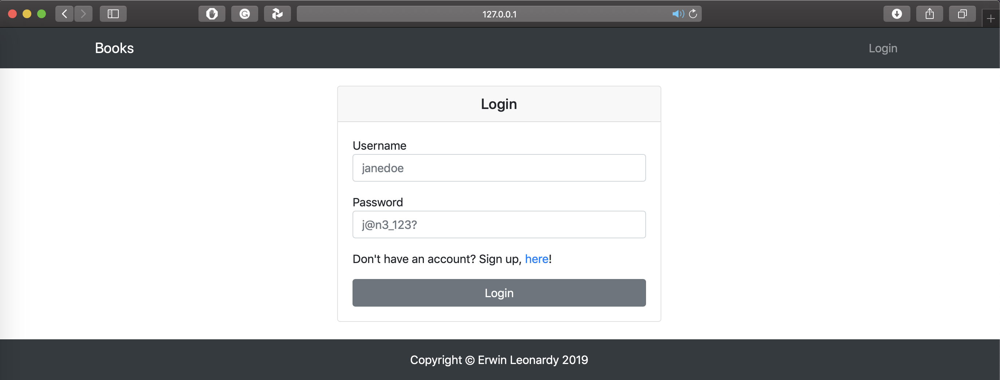
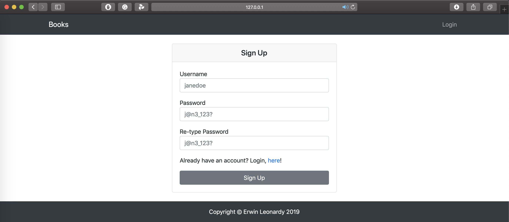
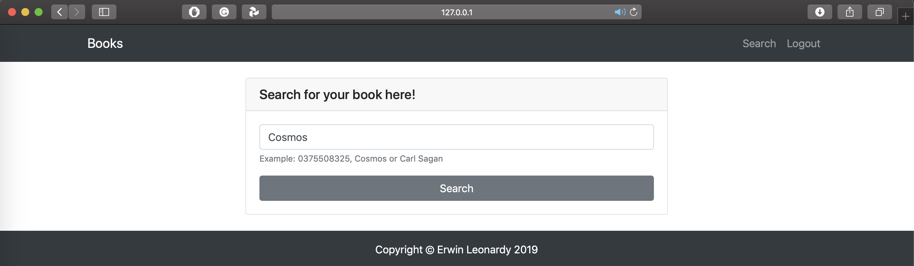
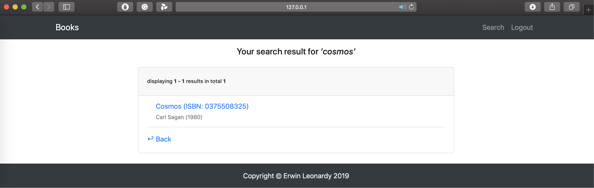
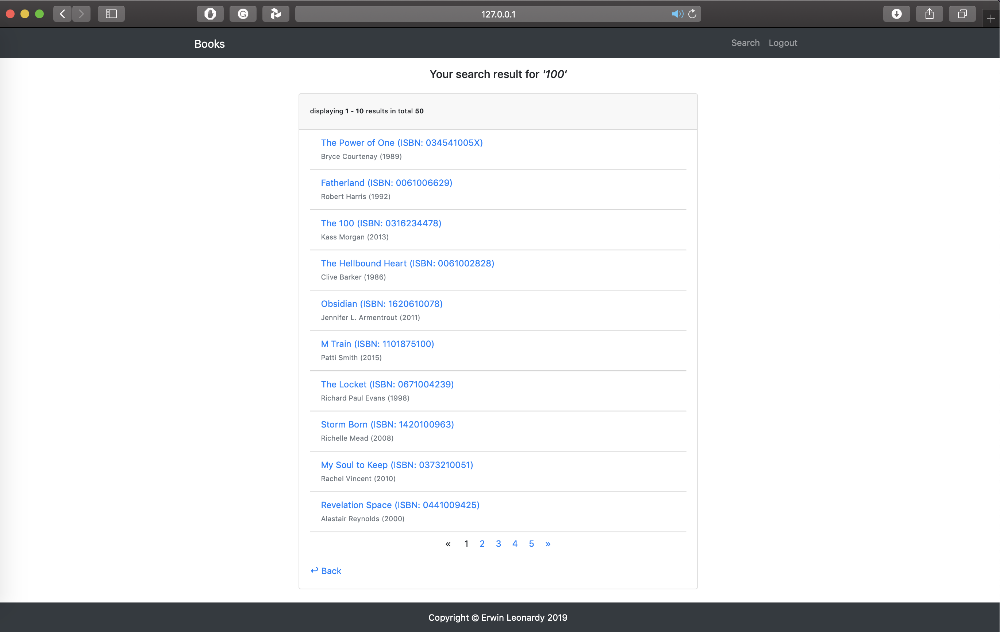

# CS50w - Project 1

Web Programming with Python and JavaScript 
(https://cs50x-erwin-books.herokuapp.com)

By: Erwin Leonardy

This mini project comprises of a lookup feature for a book based on the ibsn / book title / book author given.

It also has its own database to store user reviews seperately. Users are not allowed to edit / re-submit reviews for simplicity sake.

### Usage

* Register a new account
* Search books by name, author or ISBN
* Get info about a book and submit your own review
* API access

### Screenshots
* Login Page

* Sign Up Page

* Query Page

* Result Page

* Result Page (with pagination)


### The files are organised in this structure:

|-> *root*

|----> **src** : uses MVC architecture

|-------> **Model**

|-------> **View** : contains the user-defined HTML files for the application

|-------> **Controller**

|-----------> routes.py : this file contains the main logic of the application

|-------> **static**

|-----------> **css** : contains the user-defined css files 

|-----------> **vendor** : contains the jquery and bootstrap libraries we used.

|-> *books.csv* : contains all of the books that we want to store in the database

|-> *create.sql* : contains the sql command to create the database

|-> *import.py* : a seperate script that allows us to import the book to the database

|-> *main.py* : the entry point of our application

### How to install me?
```bash
# Clone repo
$ git clone https://github.com/erwinleonardy/cs50-project1.git

# Install all dependencies
$ pip install -r requirements.txt

# export these ENV Variables using the following commands:
export DATABASE_URL='postgres://...'
export GOODREAD_KEY='xxxxxxxxxx'
export SECRET_KEY='\x...'
export FLASK_APP='main.py'

# to run the file simply type in
flask run
```

### Thank You!
